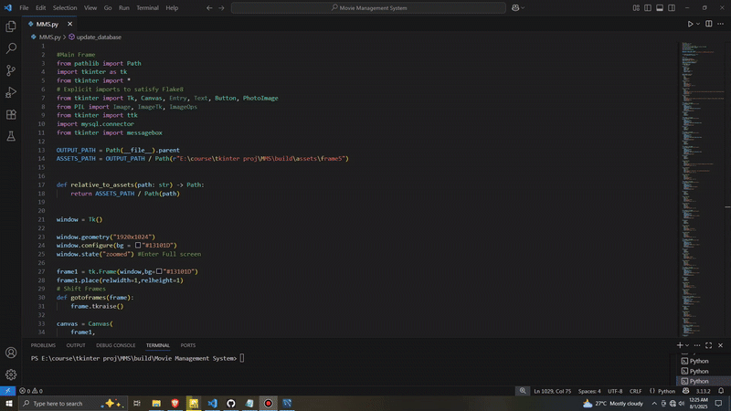

# Movie-Management-System
Movie Management System For Efficiently Managing Your Movie Database

## In MySQL Workbench, they can:

1. Go to: Server > Data Import
2. Choose: "Import from Self-Contained File"
3. Select your movielist.sql file
4. Choose "New Database" or select an existing one
5. Click Start Import
